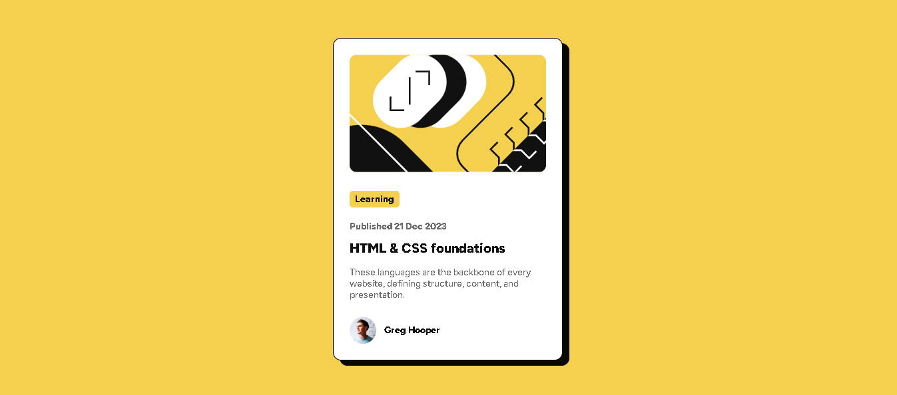

# Frontend Mentor - Blog preview card solution

This is a solution to the [Blog preview card challenge on Frontend Mentor](https://www.frontendmentor.io/challenges/blog-preview-card-ckPaj01IcS). Frontend Mentor challenges help you improve your coding skills by building realistic projects. 

## Table of contents

- [Overview](#overview)
  - [The challenge](#the-challenge)
  - [Screenshot](#screenshot)
  - [Links](#links)
- [My process](#my-process)
  - [Built with](#built-with)
  - [What I learned](#what-i-learned)
  - [Continued development](#continued-development)
  - [Useful resources](#useful-resources)
- [Author](#author)
- [Acknowledgments](#acknowledgments)

## Overview

### The challenge

Users should be able to:

- See hover and focus states for all interactive elements on the page.
- Access the content easily, ensuring it follows accessibility guidelines.

### Screenshot



This is the final solution of the blog preview card challenge. It includes semantic HTML5 markup, accessible features, and interactive hover states.

### Links

- Solution URL: [GitHub Repository](https://github.com/NkululekoCyrilCele/blog-preview-card)
- Live Site URL: [Deployed site](https://nkululekocyrilcele.github.io/blog-preview-card/)

## My process

### Built with

- Semantic HTML5 markup
- CSS custom properties
- Flexbox for layout
- Mobile-first workflow
- ARIA roles for accessibility
- Figtree font from Google Fonts

### What I learned

While working on this project, I focused on improving accessibility, responsive design, and semantic markup. One of the most valuable lessons was how to create hover and focus states that improve user interaction without media queries.

Here's an example of how I added hover states for the blog card:

```css
.card:hover .card-title,
.card:focus .card-title {
  color: var(--yellow);
}
```

This allowed the title to change color when the user hovers over the card, making it visually engaging.

### Continued development

For future projects, I want to:

- Continue improving accessibility features.
- Experiment more with CSS Grid to enhance layout design.
- Refine mobile-first workflows to make my designs more adaptable.

### Useful resources

- [MDN Web Docs](https://developer.mozilla.org/en-US/) - Excellent for reference when I needed guidance on semantic HTML.
- [CSS Tricks](https://css-tricks.com/) - Helped me better understand CSS custom properties and how to manage responsive typography.

## Author

- Nkululeko Cyril Cele
- Frontend Mentor - [@NkululekoCyrilCele](https://www.frontendmentor.io/profile/NkululekoCyrilCele)

## Acknowledgments

Special thanks to the Frontend Mentor community for inspiring me with their design challenges and insightful solutions. These challenges are a great way to sharpen coding skills!
